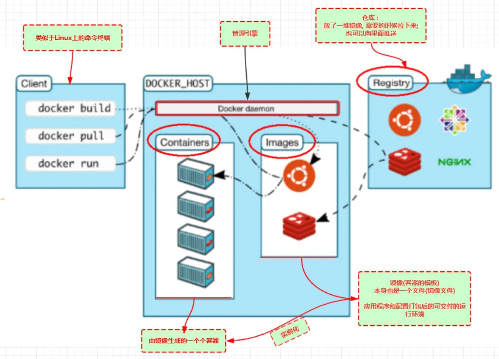
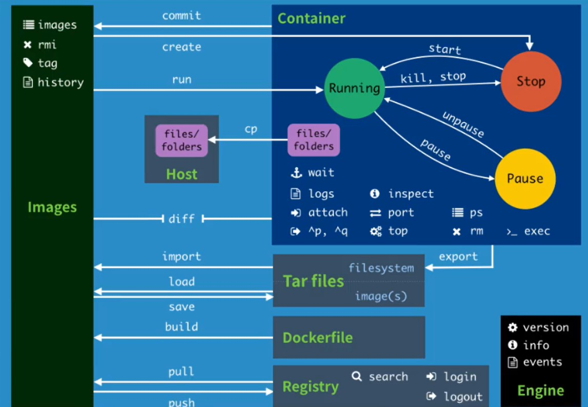

A step by step introduction to git. Also, see [reference1](https://www.bilibili.com/video/BV1og4y1q7M4?share_source=copy_web&vd_source=3ae8419b7c7c22ca47c94eefbef315ad)

<b>Outline</b>
1. What is Docker (DevOps=Devlops+Operations)
<!---->
* Docker Homepage: <https://www.docker.com/>
* Docker Documents: <https://docs.docker.com/>
* Docker Hub: <https://hub.docker.com/>
* Understand:
    - Image: Like a templete or class, can be used to create (multiple) container. E.g., tomcat image ==> run ==> tomcat01 container (provide server).
    - Container: Created by image (object). Including basic commands as run, stop, delete, etc. Like a simplified linux system.
    - Repository: The place to deposit images, including public and private repositories.
2. Install Docker @ Ubuntu 22.04 LTS
* [Method1](https://docs.docker.com/engine/install/ubuntu/): official mannual
    * Prerequisites
        - $ sudo apt-get remove docker docker-engine docker.io containerd runc
    * Install Docker Engine
        - Update the apt package index and install packages to allow apt to use a repository over HTTPS:
            - $ sudo apt-get update
            - $ sudo apt-get install ca-certificates curl gnupg lsb-release
        - Add Docker’s official GPG key:
            - $ sudo mkdir -p /etc/apt/keyrings
            - Official: $ curl -fsSL https://download.docker.com/linux/ubuntu/gpg | sudo gpg --dearmor -o /etc/apt/keyrings/docker.gpg
            - Use [aliyun](https://developer.aliyun.com/mirror/docker-ce?spm=a2c6h.13651102.0.0.76361b11j7BhdC) (optional): $ curl -fsSL https://mirrors.aliyun.com/docker-ce/linux/ubuntu/gpg | sudo gpg --dearmor -o /etc/apt/keyrings/docker.gpg
        - Use the following command to set up the repository:
            - Official: \$ echo \
            "deb [arch=\$(dpkg --print-architecture) signed-by=/etc/apt/keyrings/docker.gpg] https://download.docker.com/linux/ubuntu \
            \$(lsb_release -cs) stable" | sudo tee /etc/apt/sources.list.d/docker.list > /dev/null
            - Use [aliyun](https://developer.aliyun.com/mirror/docker-ce?spm=a2c6h.13651102.0.0.76361b11j7BhdC) (optional): \$ echo \
            "deb [arch=\$(dpkg --print-architecture) signed-by=/etc/apt/keyrings/docker.gpg] https://mirrors.aliyun.com/docker-ce/linux/ubuntu \
            \$(lsb_release -cs) stable" | sudo tee /etc/apt/sources.list.d/docker.list > /dev/null
        - Install Docker Engine
            - $ sudo apt-get update
            - $ sudo apt-get install docker-ce docker-ce-cli containerd.io docker-compose-plugin
        - [Change the mirror of Docker Hub to aliyun (optional)](https://cr.console.aliyun.com/cn-hangzhou/instances/mirrors):
            - $ sudo mkdir -p /etc/docker
            - $ sudo tee /etc/docker/daemon.json <<-'EOF' \
            { \
             "registry-mirrors": ["https://zjh3aomb.mirror.aliyuncs.com"] \
            } \
            EOF
            - $ sudo systemctl daemon-reload
            - $ sudo systemctl restart docker
        - Test and verify
            - $ sudo docker version
            - $ sudo docker run hello-world
        - Manage Docker as a non-root user
            - See <https://docs.docker.com/engine/install/linux-postinstall/>
    * [Change the default storage location of Docker images](https://mp.weixin.qq.com/s/1eJt2yjXJDc5NdYtf7IPfQ)
        - Check the present location
            - $ sudo docker info \| grep Dir
        - Shutdown the Docker service
            - $ sudo systemctl stop docker
            - $ sudo systemctl status docker
        - Move the data to the new location, e.g., /lustre/haowei/Docker/lib/docker
            - $ sudo mv /var/lib/docker /lustre/haowei/Docker/lib/
        - Modify the docker.service startup configuration file using the --graph parameter to specify the storage location 
            - Change
            - ExecStart=/usr/bin/dockerd -H fd:// --containerd=/run/containerd/containerd.sock
            - into
            - ExecStart=/usr/bin/dockerd -H fd:// --containerd=/run/containerd/containerd.sock --graph /lustre/haowei/Docker/lib/docker
        - Reload the configuration file
            - $ sudo systemctl daemon-reload
        - Restart Docker service & check
            - $ sudo systemctl start docker
            - $ sudo systemctl enable docker
            - $ sudo systemctl status docker
            - $ sudo docker run hello-world
    * [Uninstall Docker Engine] (https://docs.docker.com/engine/install/ubuntu/)
        - $ sudo apt-get purge docker-ce docker-ce-cli containerd.io docker-compose-plugin
        - $ sudo rm -rf /var/lib/docker
        - $ sudo rm -rf /var/lib/containerd
3. [Docker commands](https://docs.docker.com/engine/reference/commandline/docker/)
    * $ sudo docker xxx --help
    * $ sudo docker version
    * $ sudo docker info: system information of docker, including the number of mirrors and containers
    * Image commands
        * $ sudo docker images: [List images](https://docs.docker.com/engine/reference/commandline/images/)
        * $ sudo docker search: [Search images](https://docs.docker.com/engine/reference/commandline/search/)
        * $ sudo docker pull mirrorName:versionTag (note the versionTag is optional used for select version, w/o versionTag, the latest will be downloaded.): [Pull/download an image or a repository from a registry](https://docs.docker.com/engine/reference/commandline/pull/)
        * $ sudo docker rmi mirrorName/ID: [Remove images (such as class)](https://docs.docker.com/engine/reference/commandline/rmi/)
    * Container commands
        * $ sudo docker run: [Run a command in a new container](https://docs.docker.com/engine/reference/commandline/run/)
            - --name="aName": the name of the running container
            - -d: run on background, same as the nohup
            - -it: run in interactive mode and enter the container to view the contents
            - -c: follow a bash command, e.g. $ sudo docker run -d centos /bin/bash -c "while true;do echo kuangshen;sleep 1;done"
            - -p: specify the port 8080:8080
                - -p ip : hostPort : containerPort (most used)
                - -p hostPort : containerPort (most used)
                - -p containerPort
                - containerPort
            - -P: specify the port randomly
            - $ sudo docker ps: see the running container
                - $ sudo docker ps -a: see the run container history
            - E.g., run and enter intel/oneapi-basekit: $ sudo docker run -it intel/oneapi-basekit /bin/bash
        - Exit container
            - $ exit: exit directly
            - $ ctrl+p+q (or ctrl+p & ctrl+q): exit without shutting down the container
                - $ sudo docker attach containerID: Come back to the background container with the <b>old/running</b> bash, or [attach local standard input, output, and error streams to a running container](https://docs.docker.com/engine/reference/commandline/attach/)
                - $ sudo docker exec -it containerID /bin/bash: Come back to the background container with a <b>new</b> bash, or [run a command in a running container](https://docs.docker.com/engine/reference/commandline/exec/)
        - $ sudo docker rm containerID: [Remove container (such as object)](https://docs.docker.com/engine/reference/commandline/rm/)
        - Start/stop containers
            - $ sudo docker start containerID
            - $ sudo docker restart containerID
            - $ sudo docker stop containerID
            - $ sudo docker kill containerID
    * Other useful commands            
        - $ sudo docker logs: [Fetch the logs of a container](https://docs.docker.com/engine/reference/commandline/logs/)
            - $ sudo docker logs -tf --tail 10 containerID: see 10 pieces of logs
        - $ sudo docker top containerID: [Display the running processes of a container](https://docs.docker.com/engine/reference/commandline/top/)
        - $ sudo docker inspect containerID: [Return low-level information on Docker objects](https://docs.docker.com/engine/reference/commandline/inspect/)
        - $ sudo docker cp containerID:[path]/[filename] localPath: Copy files between host and container, similar as the scp.
    *         

4. Docker mirror
5. Docker - Data Volume
6. DockerFile
7. Docker网络原理
8. ......
